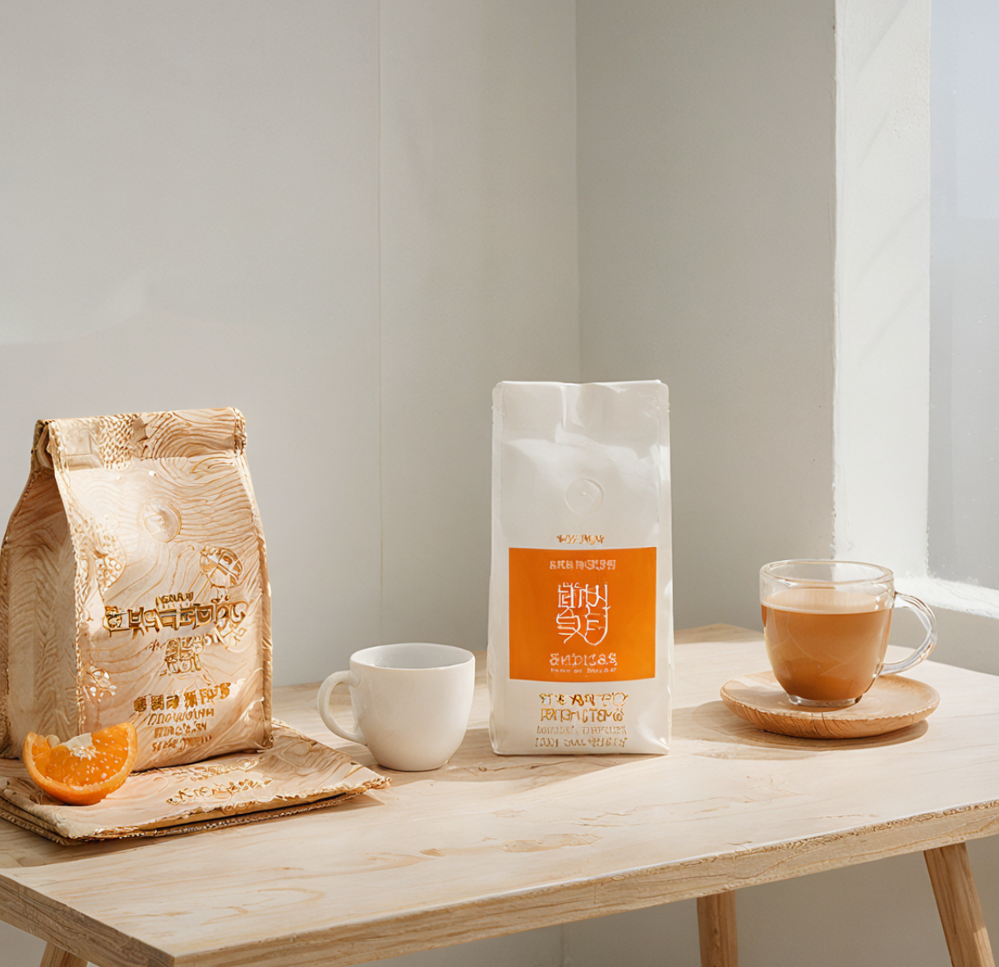

# Instructions

Some interesting and interesting content related to AI.

Committed to AI enabling cost reduction and efficiency.

## Here are my personal works

### Graphics

#### Gourmet

### Wine

### Video

<iframe width="460" height="460" src="https://player.bilibili.com/player.html?aid=1103558911" frameborder="0" allow="accelerometer; autoplay; clipboard-write; encrypted-media; gyroscope; picture-in-picture" allowfullscreen></iframe> <iframe src="//player.bilibili.com/player.html?aid=1103558911&bvid=BV1qw4m127jG&cid=1520733257&p=1" scrolling="no" border="0" frameborder="no" framespacing="0" allowfullscreen="true"> </iframe>

<!--
<iframe src="https://player.bilibili.com/player.html?aid=1103558911&bvid=BV1qw4m127jG&cid=1520733257&p=1" scrolling="no" border="0" frameborder="no" framespacing="0" allowfullscreen="true"> </iframe>
-->
